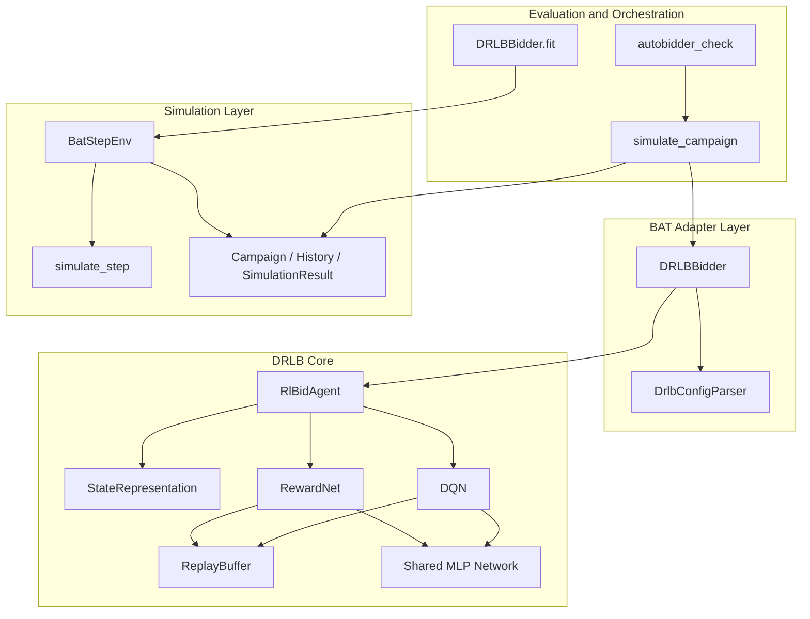
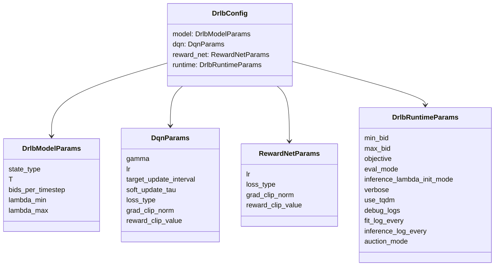
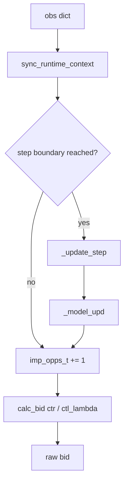
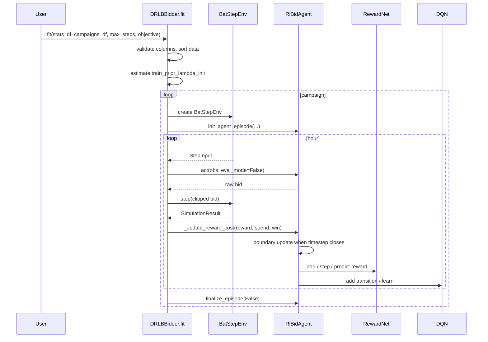
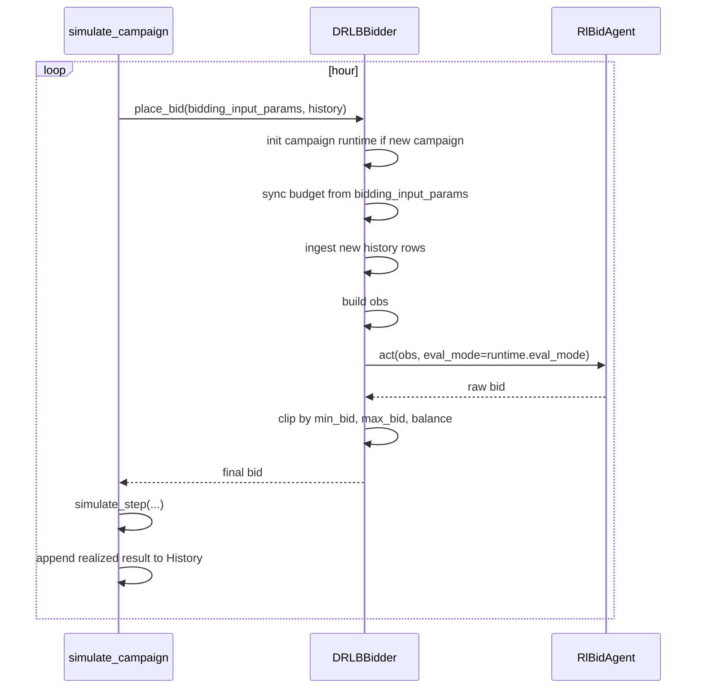

# DRLB Architecture

Date: 2026-04-21
Status: Current-state technical architecture report
Scope: `DRLBBidder`, DRLB learning core, step environment, replay subsystem, runtime API, and execution procedure

## 1. Executive Summary

This repository implements DRLB as a BAT-compatible bidder adapter around a DQN-based pacing agent. The public integration point is `simulator/model/drlb_bidder.py`, while the learning core lives under `simulator/model/drlb/`.

At a high level:

1. `DRLBBidder.fit(...)` performs offline training by rolling each campaign through a one-hour step environment (`BatStepEnv`).
2. `RlBidAgent.act(...)` maps the current campaign state to one of 7 lambda adjustment actions.
3. The chosen action updates `ctl_lambda`, and the bid is computed as `ctr / ctl_lambda`.
4. After each step boundary, the agent updates:
   - the auxiliary `RewardNet`, which estimates reward from `(state, action)`
   - the `DQN`, which learns action values from `(state, action, predicted_reward, next_state, done)`
5. During runtime evaluation, `simulate_campaign(...)` repeatedly calls `DRLBBidder.place_bid(...)`, and the adapter ingests realized history back into the agent state.

The design is intentionally split into five layers:

- Config and runtime API
- BAT adapter
- DRLB learning core
- Replay and neural networks
- Simulator environment and evaluation loop

## 2. Source Map

Primary implementation files:

- `simulator/model/drlb_bidder.py`: BAT-facing DRLB adapter, training loop, save/load
- `simulator/model/drlb/rl_bid_agent_alibaba.py`: mutable DRLB runtime agent
- `simulator/model/drlb/dqn.py`: DQN learner and target-network update logic
- `simulator/model/drlb/reward_net.py`: auxiliary reward regressor
- `simulator/model/drlb/replay_buffer.py`: generic replay buffer and collators
- `simulator/model/drlb/state_representations.py`: pluggable state families
- `simulator/model/drlb/model.py`: shared MLP backbone
- `simulator/model/drlb/config_types.py`: typed DRLB config parser
- `simulator/simulation/bat_step_env.py`: campaign-hour environment used by `fit`
- `simulator/simulation/simulate.py`: online simulation loop and step auction semantics
- `simulator/simulation/modules.py`: `Campaign`, `SimulationResult`, `History`
- `simulator/validation/check_results.py`: batch evaluation entrypoint
- `tests/test_drlb_api_smoke.py`: smoke coverage for config, replay, fit, save/load, and bidding

## 3. System Architecture

### 3.1 Component Diagram



### 3.2 Responsibility Split

| Layer | Main object | Responsibility |
|---|---|---|
| Public API | `DRLBBidder` | Exposes `fit`, `place_bid`, `save_model`, `load_model` |
| Runtime agent | `RlBidAgent` | Holds mutable episode state, chooses actions, performs per-step updates |
| RL learners | `DQN`, `RewardNet` | Learn value function and auxiliary reward estimator |
| State interface | `BaseStateRepresentation` and variants | Define state vector schema and per-step metrics |
| Replay | `ReplayBuffer` | Sample mini-batches for both learners |
| Training env | `BatStepEnv` | Converts campaign rows and stats into hourly transitions |
| Online simulator | `simulate_campaign` | Calls the bidder in a real campaign loop |

## 4. Public API Surface

### 4.1 `DRLBBidder`

Main methods:

- `__init__(params=None)`: parses config, constructs `RlBidAgent`, optionally loads a checkpoint
- `fit(stats_df, campaigns_df, max_steps=None, objective=None)`: offline pretraining loop
- `place_bid(bidding_input_params, history) -> float`: online inference entrypoint
- `get_training_diagnostics() -> pd.DataFrame`: returns logged step-level diagnostics
- `save_model(path)`: serializes config, weights, optimizers, runtime lambda state
- `load_model(path)`: reconstructs bidder state from checkpoint payload

The bidder subclasses `_Bidder`, the common interface for all benchmark bidders:

```python
place_bid(bidding_input_params: Dict[str, Any], history: History) -> float
```

### 4.2 Config API

`DrlbConfigParser` accepts either:

- a flat user dict with keys like `state_type`, `max_bid`, `dqn_lr`
- a structured checkpoint config with sections `model`, `dqn`, `reward_net`, `runtime`

Produced config object:



Important runtime knobs:

- `objective`: reward source, either `clicks` or `contacts`
- `eval_mode`: disables exploration and learning during serving/eval
- `inference_lambda_init_mode`: how online lambda is initialized
- `auction_mode`: `VCG` or `FPA`
- `min_bid` and `max_bid`: external bid clipping envelope

## 5. DRLB Core Logic

### 5.1 What the agent actually controls

The agent does not directly output a bid. It outputs one of 7 discrete action indices:

```python
BETA = [-0.08, -0.03, -0.01, 0, 0.01, 0.03, 0.08]
```

At each step boundary:

```python
ctl_lambda *= (1 + BETA[action])
bid = ctr / ctl_lambda
```

Interpretation:

- lower `ctl_lambda` increases bids
- higher `ctl_lambda` decreases bids
- DRLB therefore behaves as a pacing controller over CTR-based bids

### 5.2 Agent state machine

`RlBidAgent` owns the mutable campaign episode:

- budget state: `budget`, `rem_budget`, `rem_budget_ratio`
- time state: `t_step`, `episode_steps_total`, `ROL`, `elapsed_time_ratio`
- reward state: `reward_t`, `rewards_prev_t`, `rewards_e`, `total_rewards`
- auction state: `wins_t`, `imp_opps_t`, `cost_t`, `WR`, `BCR`
- control state: `ctl_lambda`, `dqn_action`, `eps`
- logs: `step_memory`

Core internal methods:

- `reset_episode()`: resets campaign-level state
- `configure_episode(budget, total_steps=None)`: initializes episode budget and horizon
- `sync_runtime_context(balance, initial_budget, ...)`: synchronizes runtime budget and metadata from the caller
- `_update_reward_cost(reward, cost, win)`: accumulates within-step reward/spend/win data
- `_update_step()`: computes step metrics and advances time
- `_model_upd(eval_mode, done=False)`: runs reward-net and DQN updates, then chooses the next action
- `finalize_episode(eval_mode)`: flushes the final partial step
- `act(obs, eval_mode)`: serving/training call for generating the next bid
- `calc_bid(ctr_value)`: transforms CTR and lambda into a bid

### 5.3 Action-selection flow



Boundary behavior matters:

- `act(...)` only updates the learner when `bids_processed_in_current_timestep >= bids_per_timestep`
- with the default config, `bids_per_timestep = 1`, so every call is effectively a step boundary
- after updating, the agent resets temporary per-step counters via `_reset_step()`

## 6. State Representation Layer

The project uses a pluggable state-family mechanism. Config field `state_type` must be a key in `STATE_REPRESENTATIONS` (see `get_state_repr` in `state_representations.py`).

### 6.1 State families

| Family | Dim | Uses campaign meta | Reward-net order | State fields |
|---|---:|---:|---|---|
| `ImprovedState` | 6 | No | `predict_first` | `rem_budget_ratio`, `ROL_ratio`, `BCR`, `CPI`, `WR`, `rewards_prev_t_ratio` |
| `ScaledBudgetState` | 7 | Yes | `learn_first` | `rem_budget_ratio`, `elapsed_time_ratio`, `initial_budget_scale`, `BCR`, `CPI`, `WR`, `rewards_prev_t_ratio` |
| `HybridState` | 9 | Yes | variant-dependent | `rem_budget_ratio`, `elapsed_time_ratio`, `initial_budget_scale`, `t_step`, `ROL`, `BCR`, `CPM`, `WR`, `rewards_prev_t` |
| `DefaultState` | 7 | No | `predict_first` | `t_step`, `rem_budget`, `ROL`, `BCR`, `CPM`, `WR`, `rewards_prev_t` |

### 6.2 Derived metrics

Per-step metrics are computed before learner updates:

- `BCR`: budget consumption ratio for the step
- `WR`: win rate, `wins_t / imp_opps_t`
- `CPI`: normalized cost per impression surrogate, used in CPI-based states
- `CPM`: cost per thousand wins, used in CPM-based states
- `ROL_ratio`: remaining horizon ratio
- `rewards_prev_t_ratio`: reward density per bid opportunity
- `initial_budget_scale`: `log1p(budget) / 10`

This separation is a strong engineering choice: the state schema is isolated in one file, so adding a new DRLB variant does not require touching the agent or bidder control flow.

## 7. Neural Modules

### 7.1 Shared backbone

`simulator/model/drlb/model.py` defines `Network`, a 4-layer MLP:

- `fc1`, `fc2`, `fc3`: hidden ReLU layers
- `fc4`: output layer

Default hidden width is `100` for all hidden layers. The same backbone is reused by both:

- `DQN.qnetwork_local` and `DQN.qnetwork_target`
- `RewardNet.reward_net`

### 7.2 DQN

`DQN` is the policy-value learner.

Responsibilities:

- store Q-transitions in replay
- choose epsilon-greedy actions
- maintain local and target Q-networks
- update target network by either:
  - Polyak averaging if `soft_update_tau > 0`
  - periodic hard copy every `target_update_interval` steps otherwise

Transition schema:

```python
QTransition(
    state,
    action,
    reward,
    next_state,
    done,
)
```

Training target:

```python
y = rewards + gamma * max_a' Q_target(next_state, a') * (1 - done)
```

Notable behavior:

- default `gamma = 1.0`
- loss can be `mse` or `smooth_l1`
- optional reward clipping is applied before storage
- optional gradient clipping is applied before optimizer step
- `act(...)` contains a unimodality heuristic that changes exploration aggressiveness when Q-values look abnormal

### 7.3 RewardNet

`RewardNet` learns an auxiliary mapping from state-action features to scalar reward.

Transition schema:

```python
RTransition(
    state_action,
    reward,
)
```

State-action input is built as:

```python
sa = np.append(cur_state, BETA[current_action])
```

Operational role:

1. ingest true realized reward for the step
2. predict or learn reward depending on state-family policy
3. provide `rnet_r`, the reward signal passed into DQN

The update order depends on the active state representation:

- `predict_first`: predict reward, then learn from true reward
- `learn_first`: learn first, then predict if there is enough memory; otherwise use true reward

This is one of the key engineering choices in the codebase because it changes whether DQN is trained on an immediately predicted reward or on a reward estimator that has just been updated with the new sample.

## 8. ReplayBuffer Design

The replay subsystem is shared between DQN and RewardNet through a generic `ReplayBuffer[TTransition, TSample]`.

### 8.1 Structure

Implementation details:

- storage: `collections.deque(maxlen=buffer_size)`
- sampling: deterministic `random.Random(seed)`
- output: delegated to a `collate_fn`

Important methods:

- `add(item)`: append a transition
- `sample()`: random mini-batch sample of size `batch_size`
- `__len__()`: current occupancy

### 8.2 Why this design is useful

Benefits:

- one implementation serves both Q-learning and reward learning
- batching is centralized in collators rather than duplicated in learner code
- transition types are explicit via dataclasses

### 8.3 Collation API

Two collators are provided:

- `collate_q_transitions(...)`
- `collate_reward_transitions(...)`

Both convert NumPy arrays into CPU Torch tensors with batch shape:

- Q batch: `(states, actions, rewards, next_states, dones)`
- Reward batch: `(state_actions, rewards)`

This keeps the learners simple and makes replay behavior easy to test. The smoke tests verify sample tensor shapes directly.

## 9. Environment and Simulator Setup

### 9.1 `BatStepEnv`

`BatStepEnv` is the training environment used by `DRLBBidder.fit(...)`.

Inputs:

- `stats_pdf`: historical per-hour statistics for one campaign
- `campaign_row`: metadata row with start, end, budget, campaign id
- `auction_mode`: `VCG` or `FPA`

Key methods:

- `_build_campaign(campaign_row) -> Campaign`
- `get_step_input() -> StepInput`
- `step(bid) -> SimulationResult`
- `done() -> bool`

`StepInput` exposes exactly the per-step inputs required by the agent:

- `campaign_id`
- `period_start_ts`
- `ctr_pred`
- `balance`
- `initial_balance`

### 9.2 Budget-safe stepping

`BatStepEnv.step(...)` delegates to `simulate_step(...)`, then enforces budget feasibility:

1. run auction simulation for the current hour
2. if simulated spend exceeds remaining balance, compute scaling coefficient
3. proportionally scale `spent`, `visibility`, `clicks`, and `contacts`
4. update campaign carry-over fields
5. move the campaign clock forward by one hour

This keeps training transitions aligned with campaign budget constraints.

### 9.3 `simulate_step(...)`

`simulate_step(...)` is the atomic auction semantic:

1. map bid price to a price bin
2. select the current campaign-hour slice
3. aggregate all rows with `contact_price_bin <= bid_price_bin`
4. convert the aggregate to a `SimulationResult`

Auction-mode difference:

- `VCG`: spend comes from `AuctionWinBidSurplus`
- `FPA`: spend is approximated as `AuctionContactsSurplus * bid`

## 10. Training Procedure: `fit(...)`

### 10.1 High-level flow



### 10.2 Detailed execution steps

1. Validate that `stats_df` contains BAT auction columns and `campaigns_df` contains campaign metadata.
2. Resolve training objective: `clicks` or `contacts`.
3. Estimate an initial pacing prior via `_estimate_train_prior_lambda_init(...)`.
4. For each campaign:
   - build `BatStepEnv`
   - initialize agent episode with campaign budget, horizon, and lambda init
   - until the environment is done:
     - build observation from `StepInput`
     - call `agent.act(..., eval_mode=False)`
     - clip bid into `[min_bid, min(balance, max_bid)]`
     - call `env.step(bid)`
     - convert outcome to reward using the configured objective
     - feed reward/spend/win back into the agent
5. Flush final partial state by calling `agent.finalize_episode(False)`.

### 10.3 Why `finalize_episode(...)` matters

The agent only updates on a boundary after enough calls have been processed in the current timestep. If a campaign ends mid-buffer, `finalize_episode(...)` forces:

- `_update_step()`
- `_model_upd(done=True)`
- `_record_step_history()`
- `_reset_step()`

Without this flush, the last transition of an episode would be silently lost.

## 11. Runtime Inference Procedure: `place_bid(...)`

### 11.1 Online call path



### 11.2 Runtime-specific engineering details

`place_bid(...)` is not just a pure model forward pass. It also performs state reconciliation:

- detects new campaigns and resets episode state
- synchronizes current balance and time-derived metadata
- ingests unseen `History` rows since the last call
- resolves reward source from `clicks_history` or `contacts_history`

This makes the bidder stateful across calls, which is necessary for DRLB because pacing depends on cumulative spend and previous outcomes.

### 11.3 History ingestion

`_ingest_history(...)` processes only rows that were not previously consumed:

- reward comes from the selected history reward field
- cost comes from `spend_history`
- `win = cost > 0`
- each row is forwarded to `agent._update_reward_cost(...)`

This is the bridge between the benchmark simulator's external history object and the internal RL step accumulator.

## 12. Bid Computation and Clipping

Bid generation happens in two stages:

### 12.1 Internal DRLB bid

Inside `RlBidAgent.calc_bid(ctr_value)`:

```python
bid_amt = ctr_value / ctl_lambda
bid_amt = min(bid_amt, rem_budget - budget_spent_t)
bid = max(0, bid_amt)
```

So the agent already enforces:

- non-negative bids
- no spend beyond currently remaining step budget

### 12.2 Adapter-level clipping

Inside `DRLBBidder.fit(...)` and `place_bid(...)`:

```python
upper = min(balance, max_bid)
bid = clip(raw_bid, min_bid, upper)
```

This adds:

- serving envelope control through `min_bid` and `max_bid`
- hard budget respect from the caller side

## 13. Evaluation Procedure

The main evaluation entrypoint is `autobidder_check(...)`.

Flow:

1. load campaigns CSV and stats CSV
2. instantiate a fresh bidder per campaign
3. create a `Campaign` object via `create_campaign_instance(...)`
4. run `simulate_campaign(...)`
5. aggregate histories and compute benchmark metrics via `compile_metrics(...)`

This design choice is important: bidder instances do not carry state across campaigns. Each campaign is evaluated from a fresh runtime state.

## 14. Checkpointing and Diagnostics

### 14.1 Checkpoint payload

`save_model(...)` stores:

- `config`
- local and target DQN weights
- reward-net weights
- optimizer states
- runtime state:
  - `ctl_lambda`
  - `train_prior_lambda_init`

The format is versioned by `CHECKPOINT_FORMAT_VERSION = 2`.

### 14.2 Loading procedure

`load_model(...)`:

1. validates checkpoint structure
2. reconstructs typed config
3. rebuilds the agent
4. loads network weights
5. restores optimizer states
6. restores pacing lambda state

This means checkpoints are not just weight dumps. They are resumable runtime artifacts with config validation built in.

### 14.3 Diagnostics

`step_memory` is logged as:

- `global_t`
- `rem_budget`
- `lambda`
- `eps`
- `dqn_action`
- `dqn_loss`
- `reward_signal`
- `reward_net_loss`

`get_training_diagnostics()` exposes these logs as a DataFrame for offline analysis.

## 15. Engineering Aspects and Design Notes

### 15.1 Determinism

`set_seed()` in `model.py` seeds:

- Python random
- NumPy
- Torch CPU
- Torch CUDA
- cuDNN determinism flags

The current implementation runs on CPU (`torch.device("cpu")`) in both DQN and RewardNet, which simplifies reproducibility.

### 15.2 Separation of concerns

The codebase has a practical split:

- `DRLBBidder`: orchestration and BAT compatibility
- `RlBidAgent`: mutable RL episode logic
- `StateRepresentation`: feature semantics
- `BatStepEnv`: training-time step semantics
- `simulate_campaign`: evaluation-time orchestration

This is a good maintainability property because it localizes changes:

- new state family: edit one file
- new training hyperparameter: config parser plus consumer
- new checkpoint field: save/load path only

### 15.3 Safe guards

Safety mechanisms already present:

- config validation for objectives, loss types, auction modes, and bounds
- budget clipping at both environment and adapter levels
- reward clipping hooks for both DQN and RewardNet
- optional gradient clipping for both learners
- explicit episode finalization
- checkpoint format versioning

### 15.4 Runtime assumptions

The implementation assumes:

- one campaign episode is represented by hourly slices
- the environment is driven by aggregated historical statistics, not event-level auctions
- reward is scalar and chosen from clicks or contacts
- the bidder is re-instantiated per campaign in benchmark evaluation

These assumptions are central to how DRLB is embedded into BAT.

## 16. Practical Call Graphs

### 16.1 Training call graph

```text
DRLBBidder.fit
  -> _estimate_train_prior_lambda_init
  -> _init_agent_episode
  -> BatStepEnv.get_step_input
  -> _build_fit_obs
  -> RlBidAgent.act(eval_mode=False)
       -> optional _update_step
       -> _model_upd
            -> RewardNet.add / step / act
            -> DQN.step
                 -> ReplayBuffer.add
                 -> ReplayBuffer.sample
                 -> DQN.learn
       -> calc_bid
  -> BatStepEnv.step
       -> simulate_step
  -> RlBidAgent._update_reward_cost
  -> RlBidAgent.finalize_episode
```

### 16.2 Runtime call graph

```text
autobidder_check
  -> simulate_campaign
     -> DRLBBidder.place_bid
        -> _init_campaign_runtime (first call only)
        -> _sync_budget
        -> _ingest_history
        -> _build_runtime_obs
        -> RlBidAgent.act(eval_mode=True by default)
        -> bid clipping
     -> simulate_step
     -> History.add
```

## 17. What to Read First

For a fast technical onboarding path:

1. `simulator/model/drlb_bidder.py`
2. `simulator/model/drlb/rl_bid_agent_alibaba.py`
3. `simulator/model/drlb/state_representations.py`
4. `simulator/simulation/bat_step_env.py`
5. `simulator/model/drlb/dqn.py`
6. `simulator/model/drlb/reward_net.py`
7. `tests/test_drlb_api_smoke.py`

## 18. Bottom Line

The DRLB implementation in this repo is a stateful BAT adapter around a pacing-style RL controller. The bidder itself is not a single monolithic model call. It is a coordinated runtime composed of:

- typed config parsing
- campaign-aware state synchronization
- pluggable state representations
- a DQN over lambda-adjustment actions
- an auxiliary reward estimator
- shared replay infrastructure
- a one-hour campaign simulation environment
- checkpointed runtime state for reproducible serving and evaluation

From an engineering perspective, the most important methods to understand are:

- `DRLBBidder.fit`
- `DRLBBidder.place_bid`
- `RlBidAgent.act`
- `RlBidAgent._model_upd`
- `BatStepEnv.step`
- `simulate_step`

Those methods define almost the entire training and inference lifecycle of DRLB inside BAT.
