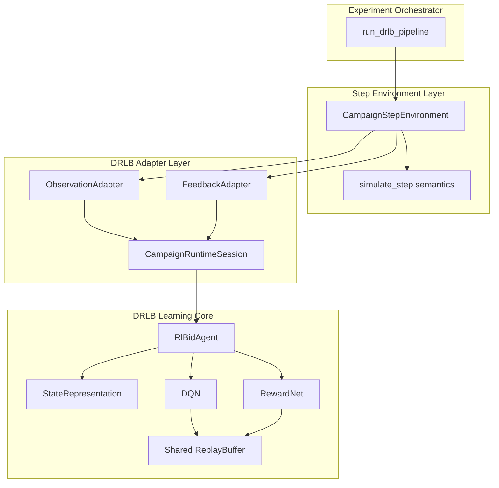
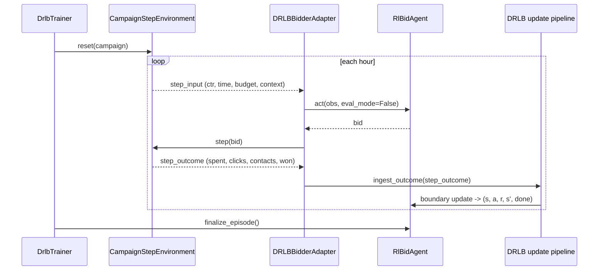
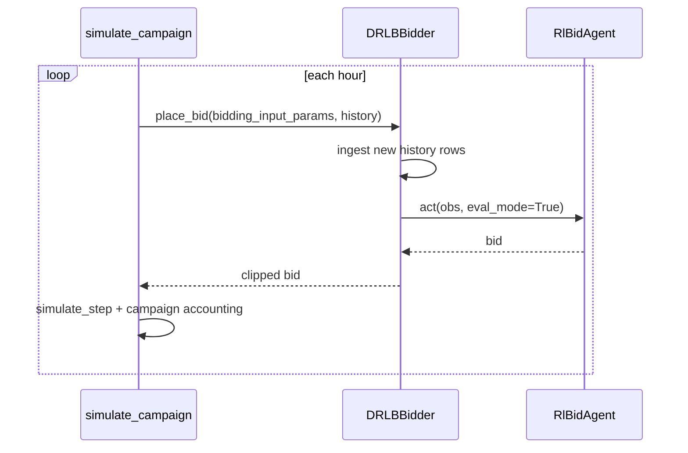

# DRLB Target View

Date: 2026-04-18
Status: Target architecture and migration blueprint (markdown-only planning artifact)
Scope: DRLB correctness, DRLB API contracts, and DRLB experiment pipeline design

## 1. Why this document exists

This file defines the DRLB end-state we want to build, not just isolated fixes.
It answers three core questions:

1. How to make DRLB training RL-correct and aligned with BAT simulation semantics.
2. How to simplify DRLB APIs so environment, adapter, bidder, states, and buffers work together predictably.
3. How to run experiments in a reproducible train/val/test procedure without silent leakage or unclear artifacts.

This is the target view used by the execution plan in `project_info/drlb_refactor.md`.

## 2. Current state check (evidence-based)

### 2.1 RL correctness gaps today

- `fit` consumes grouped historical reward/spend rows and applies them after `agent.act`, independent of simulated auction outcomes from chosen bids.
- Evidence:
  - `simulator/model/drlb_bidder.py:320-327` (grouped row aggregates)
  - `simulator/model/drlb_bidder.py:415-425` (`act` then `_update_reward_cost` with row reward/spend)
  - `simulator/simulation/simulate.py:50-108` (`simulate_step` is where bid-conditioned outcome is defined)

### 2.2 Feature semantics gaps

- `leastWinningCost` is built from `prev_bid` in online serving and from grouped `spend` in fit.
- Evidence:
  - `simulator/model/drlb_bidder.py:260`
  - `simulator/model/drlb_bidder.py:410`

- `potential_reward` is set equal to observed reward in both ingestion and fit.
- Evidence:
  - `simulator/model/drlb_bidder.py:239-244`
  - `simulator/model/drlb_bidder.py:419-424`

### 2.3 Config/API hygiene gaps

- DRLB config parsing/coercion is duplicated in `__init__` and `load_model` and partially duplicated again in `RlBidAgent._load_config`.
- Evidence:
  - `simulator/model/drlb_bidder.py:54-106`
  - `simulator/model/drlb_bidder.py:505-536`
  - `simulator/model/drlb/rl_bid_agent_alibaba.py:17-69`

### 2.4 DRLB infra duplication gap

- DQN and RewardNet keep separate near-identical replay buffers.
- Evidence:
  - `simulator/model/drlb/dqn.py:181-221`
  - `simulator/model/drlb/reward_net.py:125-157`

### 2.5 Experiment pipeline gaps to address

- Final "best" metrics are still evaluated on the same split used for tuning, and there is no explicit untouched holdout stage.
- Evidence:
  - `example_notebooks/experiments/runner_utils.py:287-325` (Optuna objective on val split)
  - `example_notebooks/experiments/runner_utils.py:331-356` (best run evaluated on same split)

- Run fingerprint hashes only campaigns CSVs, not stats CSVs.
- Evidence:
  - `example_notebooks/experiments/runner_utils.py:372-379`

## 3. Target principles

1. One step semantics everywhere.
Training, evaluation, and inference must share the same campaign-step accounting rules.

2. Action-conditioned training transitions.
DRLB updates must consume outcomes generated from the chosen bid, not exogenous aggregated labels.

3. Explicit contracts over implicit dict conventions.
Typed config and step payload objects define what each layer reads and writes.

4. Stateless orchestration, stateful runtime session.
Experiment runner orchestrates; bidder/session objects own mutable campaign state.

5. Reproducible by default.
Every run has deterministic split metadata and complete data/runtime fingerprint.

## 4. Target architecture

### 4.1 Component view



### 4.2 Sequence target for training (single campaign)



### 4.3 Sequence target for inference/evaluation



## 5. Target API contracts

### 5.1 Typed DRLB config

```python
@dataclass(frozen=True)
class DrlbModelParams:
    exp_type: str
    T: int
    bids_per_timestep: int
    lambda_min: float
    lambda_max: float

@dataclass(frozen=True)
class DqnParams:
    gamma: float
    lr: float
    target_update_interval: int
    soft_update_tau: float
    loss_type: str
    grad_clip_norm: float | None
    reward_clip_value: float | None

@dataclass(frozen=True)
class RewardNetParams:
    lr: float
    loss_type: str
    grad_clip_norm: float | None
    reward_clip_value: float | None

@dataclass(frozen=True)
class DrlbRuntimeParams:
    min_bid: float
    max_bid: float
    objective: str
    eval_mode: bool
    inference_lambda_init_mode: str

@dataclass(frozen=True)
class DrlbConfig:
    model: DrlbModelParams
    dqn: DqnParams
    reward_net: RewardNetParams
    runtime: DrlbRuntimeParams
```

One parser is used by both constructor path and checkpoint load path:

```python
config = DrlbConfigParser.from_dict(raw_dict)
config = DrlbConfigParser.from_checkpoint(checkpoint_dict)
```

### 5.2 Step-level environment contract

```python
@dataclass(frozen=True)
class StepInput:
    campaign_id: int
    period_start_ts: int
    ctr_hint: float
    balance: float
    initial_balance: float
    prev_bid: float

class CampaignStepEnvironment(Protocol):
    def reset(self, campaign_row: pd.Series) -> None: ...
    def get_step_input(self) -> StepInput: ...
    def step(self, bid: float) -> SimulationResult: ...
    def done(self) -> bool: ...
```

This contract allows DRLB `fit` to use the same outcome semantics as `simulate_step` via the existing `SimulationResult` object, without hard-wiring full `simulate_campaign` into bidder internals.

### 5.3 Adapter contracts

```python
class DrlbObservationAdapter(Protocol):
    def build_obs(self, step_input: StepInput, session: CampaignRuntimeSession) -> dict: ...

class DrlbFeedbackAdapter(Protocol):
    def to_reward_cost(self, outcome: SimulationResult, objective: str) -> tuple[float, float, float, bool]: ...
```

### 5.4 Replay storage contract

```python
@dataclass(frozen=True)
class QTransition:
    state: np.ndarray
    action: int
    reward: float
    next_state: np.ndarray
    done: bool

@dataclass(frozen=True)
class RewardTransition:
    state_action: np.ndarray
    reward: float

class ReplayBuffer(Generic[T]):
    def add(self, item: T) -> None: ...
    def sample(self) -> list[T]: ...
    def __len__(self) -> int: ...
```

DQN and RewardNet share one base implementation with separate collators.

## 6. RL correctness target details

### 6.1 Training transition semantics

Target invariant:

- `fit` transition outcome comes from step simulation (`spent`, `clicks`, `contacts`) generated after the model-selected bid.
- Reward used for Q update is explicitly defined and logged as either `true_reward` or `reward_net_prediction`.
- State transition `(s, a, r, s', done)` is produced exactly once per completed DRLB timestep.

### 6.2 Feature semantics

- `leastWinningCost` must be one of:
  - a named proxy field (for example `prevBidProxy`), or
  - a real market threshold estimate from stats and bid bin.

- `potential_reward` must either:
  - come from a separate potential-outcome estimate, or
  - be removed from state representations that rely on ratio-to-potential.

### 6.3 Boundary and done semantics

- Episode stop condition aligns with campaign horizon and budget depletion exactly once.
- Final partial timestep is always closed by `finalize_episode`.

## 7. Experiment procedure target

### 7.1 Data split policy

Use explicit three-stage protocol:

1. Train split: optimize model parameters.
2. Validation split: tune hyperparameters and pick best trial.
3. Holdout test split: run once for final report.

No trial selection should look at holdout metrics.

### 7.2 Orchestration stages

```text
prepare_splits -> tune_on_train_val -> retrain_on_train_plus_val -> evaluate_on_holdout -> publish_artifacts
```

### 7.3 Artifact contract

Minimum outputs per run:

- `run_summary.json`
- `runs_index.jsonl`
- best model checkpoint
- split manifest with campaign ids for train/val/test
- diagnostics summary for training stability

### 7.4 Reproducibility contract

Run fingerprint includes:

- campaigns hash (train/val/test)
- stats hash (train/val/test)
- git hash
- Python version
- key dependency versions
- random seed policy for split and Optuna

## 8. Migration plan from current to target

### Wave 0: Safety harness

- Add deterministic parity fixtures for campaign step accounting.
- Add assertions/logging around transition construction and done boundaries.

### Wave 1: RL correctness core

- Introduce environment-backed step transition generator for DRLB fit.
- Keep public `DRLBBidder.fit(...)` signature stable while moving internals.

### Wave 2: Typed config lifecycle

- Add dataclasses and parser.
- Migrate `__init__` and `load_model` to one normalization path.
- Keep backward compatibility adapters for old checkpoints.

### Wave 3: Feature semantics cleanup

- Replace/rename `leastWinningCost` proxy.
- Decouple or remove degenerate `potential_reward` ratio feature.

### Wave 4: Replay buffer consolidation

- Migrate DQN and RewardNet to shared replay module.
- Verify parity of sampled tensor shapes and learning curves on smoke runs.

### Wave 5: Experiment pipeline hardening

- Add holdout evaluation stage.
- Expand run fingerprint hash coverage to stats and runtime environment.

## 9. Acceptance gates

1. Train/inference parity test passes for transition accounting and budget updates.
2. Counterfactual check shows changing bid policy changes fit outcomes.
3. Config round-trip test passes (`init -> save -> load -> same effective config`).
4. Feature diagnostics show non-degenerate distributions for active state features.
5. DQN/RewardNet replay parity tests pass after shared buffer migration.
6. Experiment summary includes full hashes and split manifests; holdout report is separate from tuning report.

## 10. Risks and mitigations

- Risk: behavior drift while changing fit semantics.
  - Mitigation: golden fixtures and side-by-side old/new diagnostics for one release window.

- Risk: checkpoint compatibility break.
  - Mitigation: versioned config loader with explicit migration warnings.

- Risk: slower training due to simulator-backed steps.
  - Mitigation: batched per-campaign prefiltering and caching of hourly stats windows.

## 11. Out of scope for this track

- Redesign of non-DRLB bidders.
- Metric definition changes outside DRLB-specific gating.
- Large-scale distributed training infrastructure.

## 12. Linked execution doc

Implementation breakdown and delivery order are in:

- `project_info/drlb_refactor.md`
