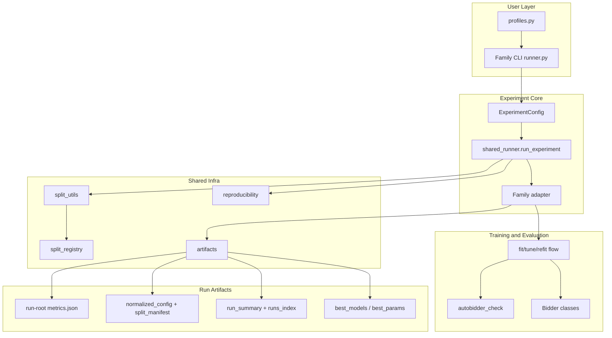
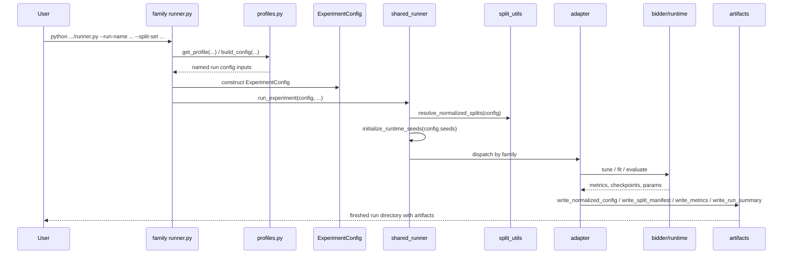
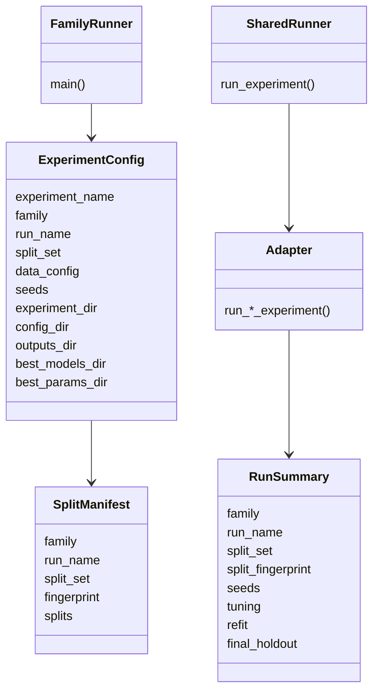

# Experiments Architecture

Date: 2026-04-22  
Status: Current-state technical architecture report and setup manual  
Scope: canonical experiment orchestration under `example_notebooks/experiments/`

## 1. Overview

This document describes the **current canonical experiments stack** used to run, compare, and inspect bidder experiments in BAT.

Главная идея новой схемы простая:

1. Выбираем или редактируем named run в family-local `profiles.py`.
2. Запускаем один стабильный CLI runner для нужного family.
3. Получаем артефакты в predictable директории вида:
   - `example_notebooks/experiments/drlb/drlb_smooth/`
   - `example_notebooks/experiments/rlb/rlb_default/`
   - `example_notebooks/experiments/baselines/linear_default/`

The canonical architecture is:

- `baselines/` for non-trainable baseline families
- `rlb/` for `RLBDPBidder`
- `drlb/` for `DRLBBidder`
- `all_comparison/` for read-only loading/comparison of completed runs
- `infra/` for shared split/config/artifact/seed utilities
- `adapters/` for family-specific orchestration logic
- `shared_runner.py` for family dispatch

`legacy/` exists only for historical/reference workflows and is **not** the preferred entrypoint.

## 2. Canonical Folder Layout

### 2.1 Tree View

```text
example_notebooks/experiments/
├── README.md
├── base_exp_config.py
├── shared_runner.py
├── infra/
│   ├── artifacts.py
│   ├── reproducibility.py
│   ├── split_registry.py
│   └── split_utils.py
├── adapters/
│   ├── baseline_adapter.py
│   ├── rlb_adapter.py
│   └── drlb_adapter.py
├── baselines/
│   ├── profiles.py
│   └── runner.py
├── rlb/
│   ├── profiles.py
│   └── runner.py
├── drlb/
│   ├── profiles.py
│   └── runner.py
├── all_comparison/
│   └── loader.py
└── legacy/
    └── ...
```

### 2.2 Responsibility Map

| Unit | Responsibility |
|---|---|
| `base_exp_config.py` | Defines `ExperimentConfig`, the immutable run configuration object |
| `shared_runner.py` | Resolves splits, seeds runtime, dispatches to family adapter |
| `infra/split_registry.py` | Central source of truth for named split sets |
| `infra/split_utils.py` | Normalizes split roles, validates paths, computes split fingerprints |
| `infra/artifacts.py` | Writes normalized config, split manifest, metrics, summary, and run index files |
| `infra/reproducibility.py` | Derives and applies seed maps |
| `adapters/*.py` | Family-specific tuning/training/evaluation flow |
| `baselines/profiles.py` | Named baseline runs like `linear_default`, `m_pid_default` |
| `rlb/profiles.py` | Named RLB runs like `rlb_default` |
| `drlb/profiles.py` | Named DRLB runs like `drlb_smooth`, `drlb_hypgrid_v2`, `drlb_hypgrid_v3` |
| `*/runner.py` | Stable CLI frontends for each family |
| `all_comparison/loader.py` | Loads finished run artifacts and checks split compatibility |

## 3. Execution Model

### 3.1 Component View



### 3.2 Runtime Sequence



### 3.3 Mental Model

В operational terms architecture is intentionally boring:

- `profiles.py` decides **what** to run
- `runner.py` decides **how the user invokes it**
- `shared_runner.py` decides **which adapter gets control**
- `adapter` decides **how this family tunes/trains/evaluates**
- `infra` decides **how config, splits, seeds, and artifacts stay consistent**

That separation is the main maintainability win of the current design.

## 4. Core Classes and Functions

### 4.1 `ExperimentConfig`

`ExperimentConfig` in `base_exp_config.py` is the canonical immutable run descriptor.

It owns:

- experiment identity:
  - `experiment_name`
  - `family`
  - `run_name`
- optimization/runtime knobs:
  - `n_trials`
  - `metric`
  - `auction_mode`
  - `max_steps`
  - `refit_on`
- data selection:
  - `split_set`
  - `data_config`
- reproducibility:
  - `master_seed`
  - derived seeds like `optuna_seed`, `model_seed`, `train_seed`
- artifact paths:
  - `family_dir`
  - `experiment_dir`
  - `config_dir`
  - `outputs_dir`
  - `best_models_dir`
  - `best_params_dir`

Important behavior:

- if `data_config` is not explicitly passed, it is resolved from `split_set`
- if `run_name` is not set, it falls back to `experiment_name`
- artifact directories are always derived as:
  - `experiments/<family>/<run_name>/...`

### 4.2 Split Registry and Split Utilities

`split_registry.py` defines named split sets such as:

- `subsample_train_val_holdout`
- `full_train_val_holdout`

`split_utils.py` turns that into normalized runtime roles:

- `train`
- `val`
- `test_holdout`

Main functions:

- `resolve_split_set(split_set)`
- `resolve_normalized_splits(config)`
- `build_trainer_data_config(...)`
- `split_fingerprint(...)`
- `build_split_manifest(...)`

Здесь находится главный invariant новой архитектуры:
**все family используют одну и ту же split-resolution mechanism**.

### 4.3 Shared Runner

`shared_runner.run_experiment(...)` is the common orchestration entrypoint.

It performs three things in order:

1. resolves normalized splits
2. initializes runtime seeds
3. dispatches by `config.family` into:
   - `run_baseline_experiment(...)`
   - `run_rlb_experiment(...)`
   - `run_drlb_experiment(...)`

This keeps family runners thin and consistent.

### 4.4 Family Adapters

Adapters are where the real family-specific orchestration lives.

#### `baseline_adapter.py`

Responsibilities:

- map `model_name` to a baseline bidder class
- invoke `BaseLineTrainer`
- evaluate best params on `val` and `test_holdout`
- write summary artifacts

Important internal units:

- `_MODEL_TO_BIDDER`
- `_MODEL_TO_TUNING_METHOD`
- `evaluate_baseline_model(...)`

#### `rlb_adapter.py`

Responsibilities:

- tune `RLBDPBidder` with Optuna
- train and save intermediate candidate checkpoints
- refit on configured training scope
- evaluate on holdout
- write run artifacts

Important internal units:

- `run_rlb_candidate(...)`
- `default_rlb_search_space(...)`
- `load_rlb_refit_inputs(...)`

#### `drlb_adapter.py`

Responsibilities:

- build DRLB bidder params from base params + sampled params
- tune `DRLBBidder`
- keep train diagnostics
- evaluate on validation split
- refit and evaluate on holdout
- write run artifacts

Important internal units:

- `build_bidder_params(...)`
- `run_drlb_candidate(...)`
- `load_refit_training_frames(...)`
- `summarize_diagnostics(...)`

### 4.5 Artifact Writers

`infra/artifacts.py` is responsible for all standard outputs:

- `write_normalized_config(...)`
- `write_split_manifest(...)`
- `write_metrics(...)`
- `write_run_summary(...)`
- `append_runs_index(...)`

This is what keeps the run directories structurally comparable across families.

## 5. Data Split Architecture

### 5.1 Canonical Split Model

There are two concepts:

1. **split set**
   - a named dataset bundle, e.g. `subsample_train_val_holdout`
2. **normalized role**
   - `train`, `val`, `test_holdout`

This means runners do not care about raw CSV names. They only ask for normalized roles.

### 5.2 Why Shared Split Resolution Matters

Если `DRLB`, `RLB`, и baseline families тренируются и валидируются на разных underlying CSV, любое сравнение становится сомнительным.

The canonical stack prevents that by:

- resolving all split paths through one registry
- storing those resolved paths in artifacts
- computing one deterministic fingerprint over campaigns + stats for all split roles

So comparability is not based on convention; it is based on recorded metadata.

### 5.3 Split Fingerprint

`split_fingerprint(...)` computes SHA-256 over:

- `train.campaigns_path`
- `train.stats_path`
- `val.campaigns_path`
- `val.stats_path`
- `test_holdout.campaigns_path`
- `test_holdout.stats_path`

and over file contents, not just names.

This means:

- if two runs share the same fingerprint, they used the same effective split inputs
- if one CSV changes, the fingerprint changes too

### 5.4 Default Validation Path

The default canonical validation path is:

- `split_set = subsample_train_val_holdout`

which maps to:

- `data/fpa/subsample/train_campaigns.csv`
- `data/fpa/subsample/train_stats.csv`
- `data/fpa/subsample/val_campaigns.csv`
- `data/fpa/subsample/val_stats.csv`
- `data/fpa/subsample/test_holdout_campaigns.csv`
- `data/fpa/subsample/test_holdout_stats.csv`

This is the fast feedback loop for architecture validation and smoke runs.

### 5.5 Switching to Full Data

To switch a canonical run from subsample to full data, the intended change is:

```bash
--split-set full_train_val_holdout
```

No runner code or adapter code changes are required.

## 6. Artifacts Contract

### 6.1 Per-Run Directory Model

Each named run writes into:

```text
example_notebooks/experiments/<family>/<run_name>/
```

Example:

```text
example_notebooks/experiments/drlb/drlb_smooth/
├── metrics.json
├── config/
│   ├── normalized_config.json
│   └── split_manifest.json
├── outputs/
│   ├── metrics.json
│   ├── run_summary.json
│   └── runs_index.jsonl
├── best_models/
│   └── best_refit.pt
└── best_params/
```

### 6.2 Meaning of Key Files

#### Root `metrics.json`

Fast human-facing entrypoint for “what was the final result of this run?”

This is intentionally duplicated from `outputs/metrics.json` so a run directory is easy to scan.

#### `config/normalized_config.json`

Serialized `ExperimentConfig` view with derived paths and seeds.

Use it when you want to understand:

- what run was launched
- where artifacts went
- what seed map was used
- what split set was selected

#### `config/split_manifest.json`

Explicit split contract for the run.

Contains:

- `family`
- `run_name`
- `split_set`
- `fingerprint`
- resolved split paths

This is the main comparability contract between families.

#### `outputs/run_summary.json`

Rich structured output for the whole run:

- header metadata
- split fingerprint
- tuning summary
- best params
- validation metrics
- final holdout metrics

#### `outputs/runs_index.jsonl`

Append-only lightweight index of run stages/metrics.

Useful for later aggregation and longitudinal tracking.

#### `best_models/`

Present for trainable families:

- `rlb/` stores `.pkl` checkpoints
- `drlb/` stores `.pt` checkpoints

#### `best_params/`

Present when tuning produces a parameter artifact:

- especially relevant for baseline and RLB flows

### 6.3 Guaranteed vs Family-Specific Outputs

Guaranteed for canonical completed runs:

- `metrics.json`
- `config/normalized_config.json`
- `config/split_manifest.json`
- `outputs/run_summary.json`

Usually present for tuned runs:

- `outputs/runs_index.jsonl`

Family-dependent:

- `best_models/`
- `best_params/`

## 7. How To Run Experiments

### 7.1 Baselines

Default subsample run:

```bash
python example_notebooks/experiments/baselines/runner.py \
  --run-name linear_default
```

Run on full split:

```bash
python example_notebooks/experiments/baselines/runner.py \
  --run-name linear_default \
  --split-set full_train_val_holdout
```

Override number of Optuna trials:

```bash
python example_notebooks/experiments/baselines/runner.py \
  --run-name m_pid_default \
  --n-trials 5
```

### 7.2 RLB

Default subsample run:

```bash
python example_notebooks/experiments/rlb/runner.py \
  --run-name rlb_default
```

Verbose full-data run:

```bash
python example_notebooks/experiments/rlb/runner.py \
  --run-name rlb_default \
  --split-set full_train_val_holdout \
  --verbose
```

### 7.3 DRLB

Default subsample run:

```bash
python example_notebooks/experiments/drlb/runner.py \
  --run-name drlb_smooth
```

Switch profile:

```bash
python example_notebooks/experiments/drlb/runner.py \
  --run-name drlb_hypgrid_v3
```

Run on full data:

```bash
python example_notebooks/experiments/drlb/runner.py \
  --run-name drlb_smooth \
  --split-set full_train_val_holdout
```

Override train budget for fast smoke run:

```bash
python example_notebooks/experiments/drlb/runner.py \
  --run-name drlb_smooth \
  --max-train-steps 16 \
  --n-trials 1
```

### 7.4 Temporary Artifact Root for Smoke Runs

All family runners support `--artifacts-root`, which is useful for quick checks:

```bash
python example_notebooks/experiments/drlb/runner.py \
  --run-name drlb_smooth \
  --artifacts-root /tmp/bat-exp-smoke-drlb
```

Это удобно, когда хочется проверить pipeline end-to-end без записи артефактов в repo-local run directories.

## 8. How To Add a New Run

### 8.1 General Rule

The preferred workflow is:

1. add or edit a named run in the family `profiles.py`
2. launch through that family’s `runner.py`
3. inspect artifacts in `experiments/<family>/<run_name>/`

### 8.2 Add a New Baseline Run

In `baselines/profiles.py`:

1. add a new entry to `_BASELINE_PROFILES`
2. choose:
   - `model_name`
   - `n_trials`
3. run it through:
   - `baselines/runner.py --run-name <new_name>`

Example mental model:

- `linear_default` and `m_pid_default` are not different codepaths
- they are different named profiles over the same family runner

### 8.3 Add a New RLB Run

In `rlb/profiles.py`:

1. add a new entry to `_RLB_PROFILES`
2. define:
   - `n_trials`
   - `model_config["base_params"]`
3. run via:
   - `rlb/runner.py --run-name <new_name>`

### 8.4 Add a New DRLB Run

In `drlb/profiles.py`:

1. add a new entry to `_DRLB_PROFILES`
2. define:
   - `state_type`
   - `objective`
   - `base_drlb_params`
   - `reference_model_params`
   - `search_space_fn`
   - `n_trials`
   - `max_steps`
3. run via:
   - `drlb/runner.py --run-name <new_name>`

This is the canonical replacement for the older `exp_*`-specific script model.

## 9. Comparison Layer

`all_comparison/loader.py` is intentionally small and read-only.

It currently provides:

- `discover_run_dirs(...)`
- `load_metrics_table(...)`
- `assert_matching_split_fingerprint(...)`

### 9.1 What It Does

It scans completed canonical run directories under:

- `baselines/`
- `rlb/`
- `drlb/`

and reads:

- `outputs/run_summary.json`
- `outputs/metrics.json`
- `config/split_manifest.json`

### 9.2 Why It Matters

Before comparing runs, it can verify that they share the same split fingerprint.

Это важно, потому что otherwise one could accidentally compare:

- DRLB trained on subsample
- RLB trained on full split
- baseline trained on another CSV snapshot

and think the plot is meaningful.

The current comparison layer prevents that kind of silent mismatch.

## 10. Unit Overview

### 10.1 Relationship Diagram



### 10.2 Practical Unit Boundaries

The system breaks into six practical units:

1. **Profile definition**
   - `profiles.py`
2. **CLI entrypoint**
   - `runner.py`
3. **Canonical run config**
   - `ExperimentConfig`
4. **Shared infra**
   - splits, artifacts, seeds
5. **Family orchestration**
   - adapters
6. **Post-run loading/comparison**
   - `all_comparison/loader.py`

If you understand those six units, you understand the whole experiments architecture.

## 11. Documentation Drift Note

`project_info/project_structure.md` still describes the older `exp_*`, `exp_configs.py`, and `runner_utils.py` model as if it were the primary experiment architecture.

For the experiments layer, this file (`experiments_architecture.md`) should be treated as the more current architectural source of truth.

## 12. Bottom Line

The canonical experiments stack is a **family-runner architecture with shared infrastructure and per-run artifact directories**.

Operationally, it is designed to answer three needs at once:

- easy setup and repeatable CLI execution
- comparable train/val/test split resolution across families
- predictable, inspectable run artifacts

The key design choices are:

- profiles define runs
- runners stay thin
- shared runner handles dispatch
- adapters own family-specific orchestration
- shared infra owns splits, seeds, and artifact contracts
- comparison is read-only and split-aware

Если смотреть совсем practically, новая usage model такая:

1. Меняешь profile.
2. Запускаешь family `runner.py`.
3. Смотришь артефакты в `experiments/<family>/<run_name>/`.
4. Сравниваешь completed runs только после проверки split fingerprint.

That is the current architectural intent of the experiments layer in this repository.
